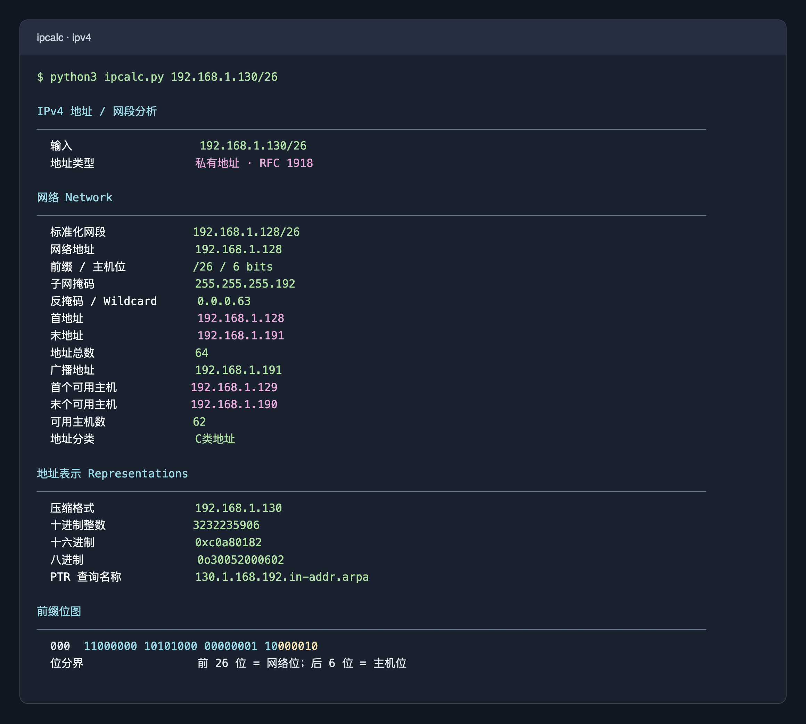
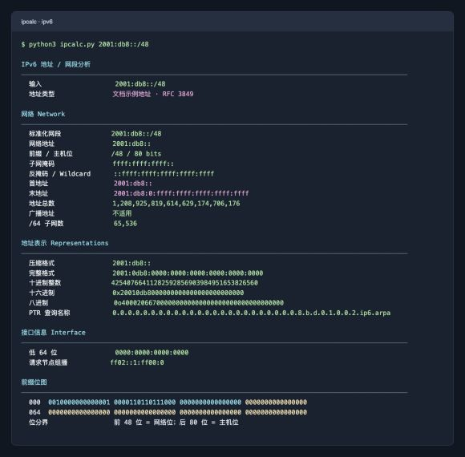
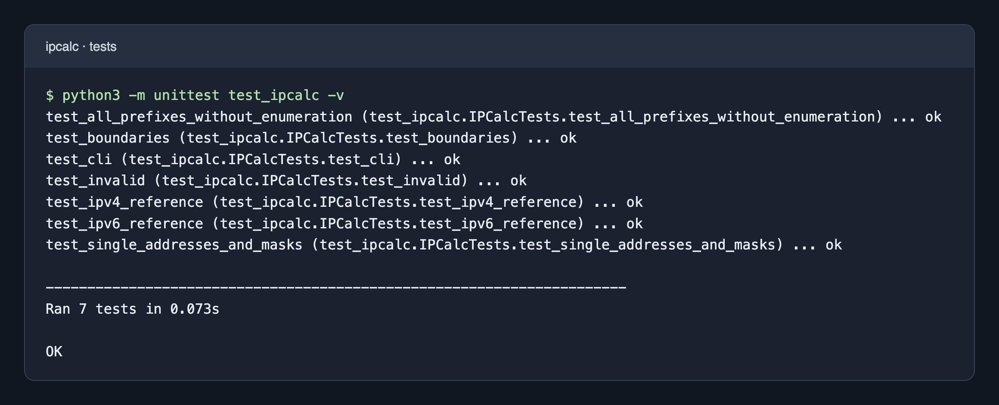

# IPv4 / IPv6 终端计算器

仅依赖 Python 标准库，不联网，不查询 DNS。建议使用 Python 3.13 或更新版本。

## 快速开始

```bash
python3 ipcalc.py 192.168.1.130/26
python3 ipcalc.py 2001:db8::/48
python3 ipcalc.py 192.168.1.130
python3 ipcalc.py 2001:db8::1234
```

只需一个位置参数：IP 或 CIDR；IPv4 也接受 `192.168.1.130/255.255.255.192`。省略前缀时 IPv4 为 `/32`，IPv6 为 `/128`。带主机位的输入会计算所属网段，地址表示仍对应原始输入 IP。非法输入返回退出码 2。

交互终端中：左侧字段为亮白色，青色表示网络位，黄色表示主机位，绿色表示结果，紫色表示地址类型及首尾地址。重定向或管道输出自动去除颜色，也可以设置环境变量 `NO_COLOR=1`。

## 功能介绍

输入一个 IP 地址或网段，即可查看所属网络、地址范围、地址数量和多种编码表示，适合网段规划、配置核对及理解前缀位划分。

- IPv4：网段、掩码、反掩码、广播地址、首末主机、主机数、地址总数、地址分类。
- IPv6：网段、掩码、完整范围、地址总数、`/64` 子网数、低 64 位和请求节点组播。
- 通用：十进制、十六进制、八进制、二进制位图、PTR 查询名称。

## 计算规则

IPv4 的“首地址”和“末地址”显示网段完整范围；“首个可用主机”和“末个可用主机”显示可用主机范围。终端省略提示、颜色图例及括号说明。IPv4 `/31` 按点对点链路处理，`/32` 为一个地址。IPv6 没有广播地址，总数不扣除首末地址，也不宣称等于可分配主机数。低 64 位仅在适用的 `/64` 单播子网中解释为接口 ID；不能仅凭全零低位推断任意前缀的任播用途。

地址分类仅针对输入 IP；宽前缀可能覆盖多种类型。常见特殊用途前缀单独标注，其余采用当前 Python `ipaddress` 分类，并非实时 IANA 注册表查询。全局属性不保证实际路由可达。

PTR 字段是查询名称，不是实际 DNS 查询结果。

计算使用整数运算，不枚举地址，IPv6 `/0` 也可直接计算。

## 测试

验证命令（在脚本目录执行）：

```bash
python3 -m unittest test_ipcalc -v
```

语义参考：[Python ipaddress](https://docs.python.org/zh-cn/3.13/library/ipaddress.html)、[IPv6 RFC 4291](https://www.rfc-editor.org/rfc/rfc4291.html)。


7 项测试覆盖图片示例、IPv4 `/0`、`/31`、`/32`，IPv6 `/0`、`/127`、`/128`，全部合法前缀长度、单地址、点分掩码和非法输入，并检查命令行退出码及管道输出。

## 运行结果截图

以下图片来自脚本的实际运行输出，以终端配色排版后截图；测试环境为 Python 3.13.15。具体颜色会随终端主题变化。

### IPv4 网段分析

输入 `192.168.1.130/26`，所属网段为 `192.168.1.128/26`，共 64 个地址，可用主机为 `192.168.1.129` 至 `192.168.1.190`，共 62 个。



### IPv6 网段分析

输入 `2001:db8::/48`，共 `2^80` 个地址，包含 65,536 个 `/64` 子网；位图显示前 48 位网络位和后 80 位主机位。



### 自动化测试

实际运行 `python3 -m unittest test_ipcalc -v`，7 项测试全部通过。


